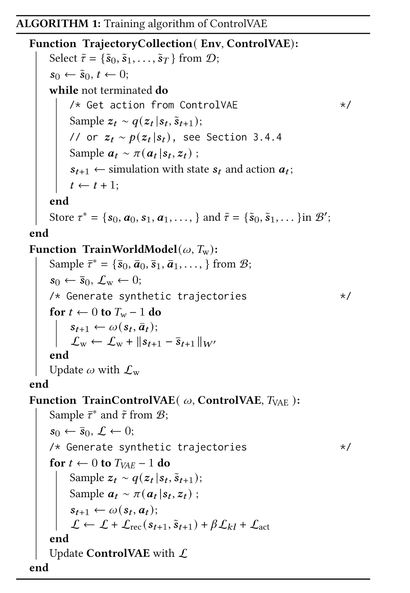

# cvae-animacy

## math and technical analysis 

1. $s_t$: t时刻的state，在我们的任务中约定为所有球的坐标。比如2个player时，$s_t = (x_1, y_1, x_2, y_2, x_b, y_b)$,下标b表示球。
2. $a_t$: t时刻的action，在我们的任务中具体化为$\Delta x_t$ (或者说t时刻的速度)。比如两个player时，$a_t = (\delta x_1, \delta y_1, \delta x_2, \delta y_2, \delta x_b, \delta y_b)$。
   
我们的world model不需要训练，因为已知ground truth的转移为，
$$
    p(s_{t+1} | s_t, a_t) = \begin{cases} 
        +\infty, \ if \ s_{t+1} = s_t + a_t \\
        0, \ else
    \end{cases}
$$

注：$p(s_{t+1} | s_t, a_t)$ 表示概率密度。意味着 $s_{t+1} = s_t + a_t$ 时，100%转移到 $s_{t+1}$.

3. $z_t$: t时刻的隐变量，实际意义可以理解为$a_t$的latent表示。VAE建模的联合分布为 $Pr(s_{t+1}, z_t | s_t)$。

### 需要train的neural network 

#### 1.conditional prior distribution of lantent variable $p(z_t | s_t)$ 
规定 $p(z_t | s_t) \sim N(\mu_{\theta_p}(s_t), \sigma_p^2 I)$，其中$\sigma_p$为hyper param. ，用NN计算高斯分布的mean。 

#### 2. control policy $z_t \to a_t$的建模 ：$\pi(a_t | z_t , s_t)$
规定 $\pi(a_t | z_t , s_t) \sim N(\mu_{\pi_\theta}(s_t, z_t), \Sigma_{\pi_{\theta}}(s_t, z_t))$, 并规定协方差矩阵diagonal。用NN计算高斯分布的mean, covariance。

VAE的Decoder原本为：$p(s_{t+1} | s_t, z_t) = \int_{a_t} p(s_{t+1} | s_t, a_t)\cdot \pi(a_t | s_t, z_t)da_t$。根据ground truth转移的定义，可以化简为
$$
p(s_{t+1} | s_t, z_t) = \pi(s_{t+1}- s_t | s_t, z_t)=N(\mu_{\pi_\theta}(s_t, z_t), \Sigma_{\pi_{\theta}}(s_t, z_t); s_{t+1} - s_t)
$$
这里的 $p(\cdot)$ 都是概率密度。

#### 3. VAE的encoder $q(z_t | s_{t+1}, s_t)$
规定为Gaussian分布：$q(z_t | s_{t+1}, s_t) \sim N(\hat \mu_{q_{\theta}}(s_{t+1}, s_t), \sigma^2_q I)$。其中 $\sigma_q$ 为hyper param. 且规定 $\sigma_p = \sigma_q$。用NN预测高斯分布的mean。

注意：实际代码中，我们学 $\hat\mu_q - \mu_p$ 这个residue。令 $\hat \mu_q - \mu_p = \mu_q$, 其中 $\mu_q = \mu_{q_\theta}(s_{t+1}, s_t)$ 为neural network的结果。

这样的好处在于方便计算Loss中KL Divergence的部分：
$$
D_{KL}(q(z_t | s_{t+1}, s_t) || p(z_t | s_t)) = \frac {\mu_q^T\cdot \mu_q}{2\sigma_p^2}
$$

### training 部分

#### reconstruction loss 
$$
L_{rec} = \sum_{t=0}^{T-1} \gamma^t \mathbb E_{z_t \sim q(z_t | s_t, \tilde s_{t+1}), a_t\sim \pi(a_t | s_t, z_t)} (||\tilde s_{t+1} - (s_t + a_t)||^2) 
$$

先取一个sample, $\tilde \tau = (\tilde s_0, \tilde s_1,..., \tilde s_T)$, 令 $s_0 \leftarrow \tilde s_0$。对于$t=0,1,...,T-1$，根据 $s_t, \tilde s_{t+1}$ sample $z_t$, 再根据$s_t, z_t$ sample $a_t$。令 $s_{t+1} \leftarrow s_t + a_t$。单步reconstruction loss为 $\gamma^t ||\tilde s_{t+1} - s_{t+1}||^2$ 

#### KL loss 
$$
L_{KL} = \sum_{t=0}^{T-1} \gamma^t \frac {||\mu_q(s_t, \tilde s_{t+1})||^2}{2\sigma_p^2}
$$

#### regularization term 
$$
L_{act} = \sum_{t=0}^{T-1} \gamma^t w_{a}||a_t||^2 
$$
其中$w_a$为超参数。

#### 总Loss 
$$
L = L_{rec} + \beta_{epoch}\cdot L_{KL} + L_{act}
$$
原论文中 $\beta$ 从0.01增加到0.1，每500个epoch增加一次。 

### training algorithm 

#### 注意：没有提到的
1. reparameterization trick 